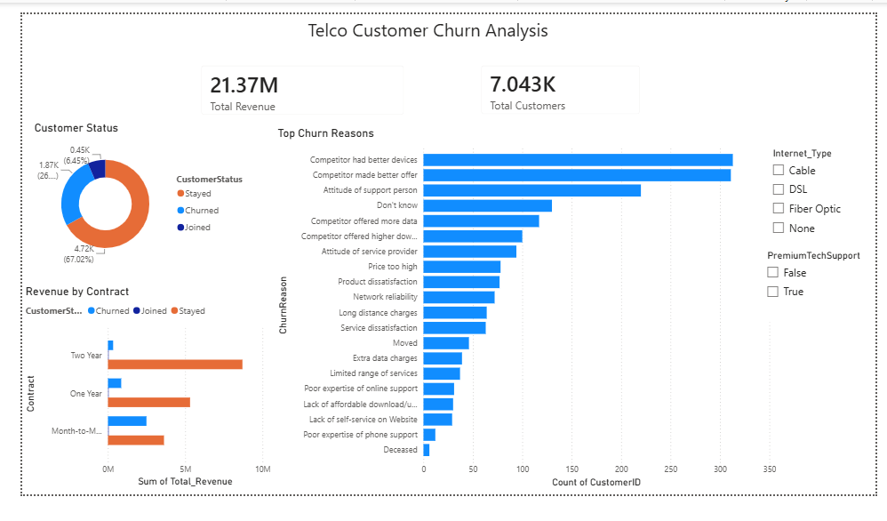

# 📊 Telco Customer Churn Analysis: End-to-End Data Project

## 📝 Project Overview
This project focuses on analyzing customer churn for a telecommunications company. The primary objective is to identify key drivers of customer attrition, pinpoint high-risk customer segments, and quantify the financial impact of lost revenue. By providing data-driven insights, this dashboard empowers stakeholders to make informed decisions to improve customer retention.

## 🛠️ Tech Stack & Tools
* **Microsoft SQL Server:** Data manipulation, data cleaning, and exploratory data analysis (EDA).
* **Power BI:** Data visualization, interactive dashboard design, and DAX metric calculations.
* **T-SQL:** Advanced querying including CTEs, Window Functions (`DENSE_RANK()`), and Data Manipulation Language (DML).

## 🚀 Key Business Insights
Based on the SQL analysis and Power BI visualization, the following insights were uncovered:
1. **Executive Metrics:** The company serves **7.04K customers**, generating **$21.37M** in total revenue. However, the churn rate stands at a concerning **26.5%**.
2. **Contract Type Risk:** The highest concentration of churned customers comes from **Month-to-Month** contracts, indicating a significant lack of long-term commitment and high susceptibility to competitor offers.
3. **Top Churn Drivers:** Competitor actions heavily influence churn. The primary reasons for leaving are:
   * Competitor had better devices.
   * Competitor made better offers.
   * Poor attitude of support persons.
4. **Service Impact:** Customers without **Premium Tech Support** and those using specific internet types showed a significantly higher propensity to churn.

## 📂 Project Files
* `01_Data_Cleaning.sql`: SQL script used to clean the raw data, handle NULL values, trim whitespaces, standardize column names, and enforce correct data types.
* `02_Business_Analysis.sql`: SQL script containing complex queries (CTEs, Window Functions) used to extract KPIs and deep-dive churn drivers.
* `Telco_Churn_Dashboard.pbix`: The interactive Power BI dashboard file.
* `Dashboard_Screenshot.png`: A high-resolution snapshot of the final visualization.
* `Dataset.csv`: The raw dataset used for this analysis.

## 📈 Dashboard Snapshot

## 💡 Recommendations
* **Incentivize Long-term Contracts:** Launch targeted campaigns offering discounts or free premium services to convert Month-to-Month users into 1-Year or 2-Year contracts.
* **Enhance Customer Service:** Address the "attitude of support person" issue through rigorous staff training and QA monitoring.
* **Match Competitor Hardware:** Since better devices are a primary exit reason, the product team must evaluate the current hardware offerings and align them with market standards.

---
*Created as part of a comprehensive Data Analytics Portfolio.*
